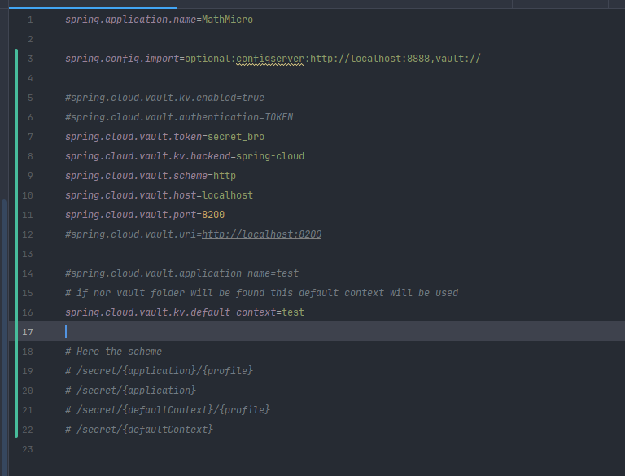

# How to create secrets manually:

> **Attention!** Please take in the consideration the fact that all needed secrets
> are created at container startup. You don't need to create secrets manually.
> 
> This instruction might be useful if you want to provide your own secrets...

1) Execute `docker compose up -d` in the terminal
2) Head to http://localhost:8200
3) Set Method to token and Token is password id from docker-compose file
4) Go to Secrets Engines
5) Hit **Enable new engine +** button and select a simple key-value secret engine (KV)
6) Set these values here:\

7) Than hit the **Create Secret +** button
8) Create **two** secrets as shown below\

9) Final result\


# How to use in code:

1) Add a dependency

```xml
<!--    NEEDED TO CONNECT TO VAULT-->
<dependency>
    <groupId>org.springframework.cloud</groupId>
    <artifactId>spring-cloud-starter-vault-config</artifactId>
</dependency>
```

2) Add `application.properties`

```properties
#   spring.config.import=vault:// 
# loads all the data from the vault (all the Secret Engines)
# We can even import a SPECIFIC SECRET CONTEXT PATH 
# and get rid of: 
#   spring.cloud.vault.kv.backend=spring-cloud 
# and
#   spring.cloud.vault.application-name=test
#   or
#   spring.cloud.vault.kv.default-context=test
# like this:
#
# spring.config.import=vault://spring-cloud/api-secrets
#   #spring.cloud.vault.kv.backend=spring-cloud
#   #spring.cloud.vault.application-name=api-secrets
#   #or
#   #spring.cloud.vault.kv.default-context=api-secrets
   


spring.config.import=vault://
#spring.cloud.vault.kv.enabled=true
#spring.cloud.vault.authentication=TOKEN
spring.cloud.vault.token=secret_bro
spring.cloud.vault.kv.backend=spring-cloud
spring.cloud.vault.scheme=http
spring.cloud.vault.host=localhost
spring.cloud.vault.port=8200
#spring.cloud.vault.uri=http://localhost:8200
spring.cloud.vault.application-name=test
# if nor vault folder will be found this default context will be used
#spring.cloud.vault.kv.default-context=test
# Here the scheme
# /secret/{application}/{profile}
# /secret/{application}
# /secret/{defaultContext}/{profile}
# /secret/{defaultContext}

```

3) Use in code this way:

```java

@Value("${default-secret:unknown}")
private String def;

@Value("${test:unknown}")
private String test;

public void show() {
    System.out.println();
    System.err.println("def: " + def);
    System.out.println();
    System.err.println("test: " + test);
    System.out.println();
}
```

> **Note:** For this you have to create tho more "folders" besides **_api-secrets_** - **_test_** with **test** secret
> and **_<application.name>_** ( ex. mathmicro) with **default-secret**  like this\
> 
> 
> 
> 
> properties in the app\
> 
> 
> app output\
> 
> 
> for code\
> 